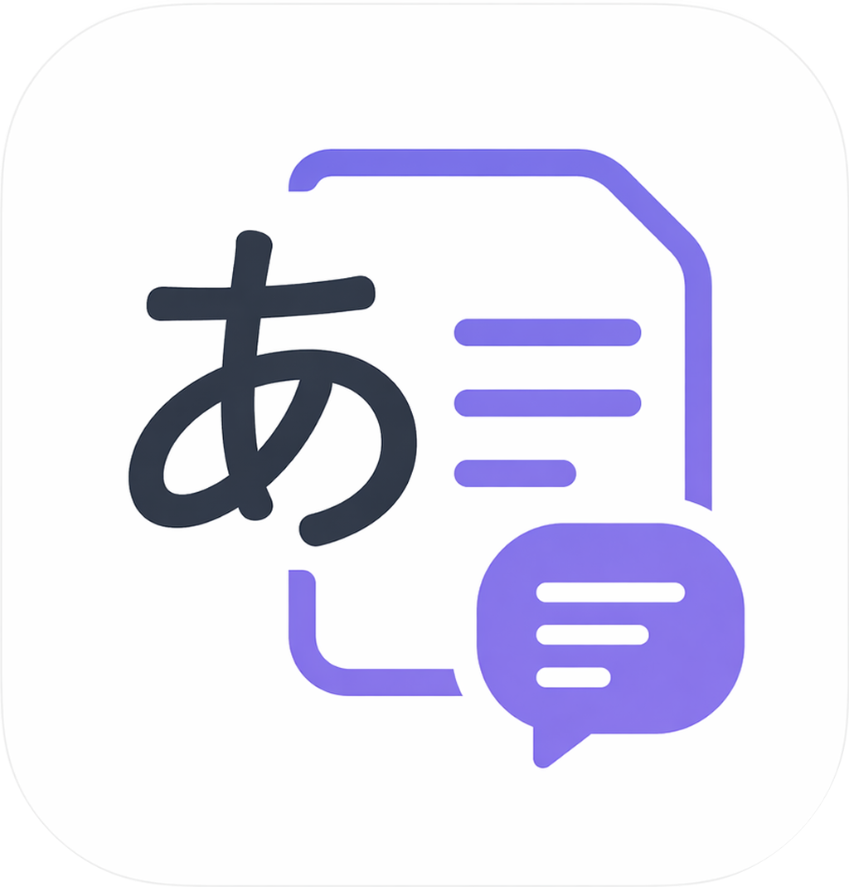
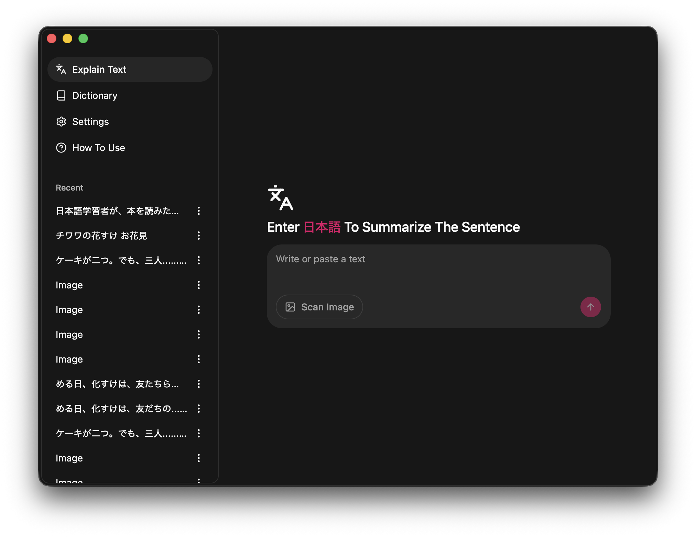
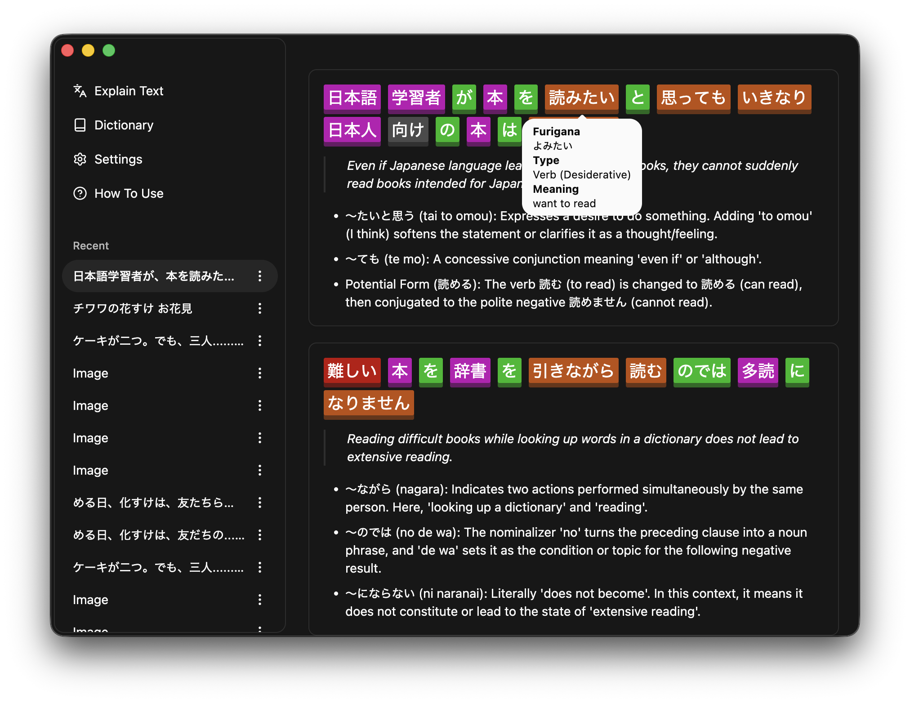

<!-- PROJECT LOGO -->
 

  

  <h3 align="center">Nihongo Buddy</h3>

A tool for summarizing Japanese text, made for people who prefer learning Japanese by reading. It captures your screen to translate and summarize what's on it.

### Features

- **Translation and Summarization**: Provide any text or image containing Japanese and it will summarize it.
- **Shortcut Key**: Press a customizable shortcut key to capture a screenshot and translate without needing to open the app.
- **Dictionary (Coming Soon)**: The app will include a dictionary soon.
- **Anki Integration (Coming Soon)**: Anki integration for word mining will be coming soon.

### Setup

1. Get an LLM API key.
2. Run the app.
3. Open Settings and configure the LLM and shortcut key.

### Usage

**Method 1:** Go to the "Explain Text" section and paste any Japanese text, or upload an image containing Japanese text.

**Method 2:** Open anything that contains Japanese and use the shortcut key.

### Report Issues

Please report any issues on this page:
https://github.com/siddharthroy12/nihongobuddy/issues

## Roadmap

- Add dictionary.
- Add in-app usage instructions.
- Add Anki integration.
